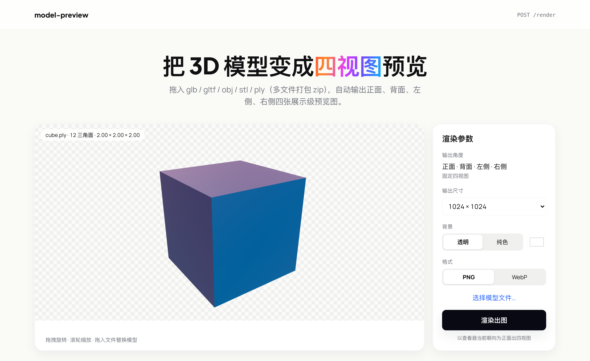
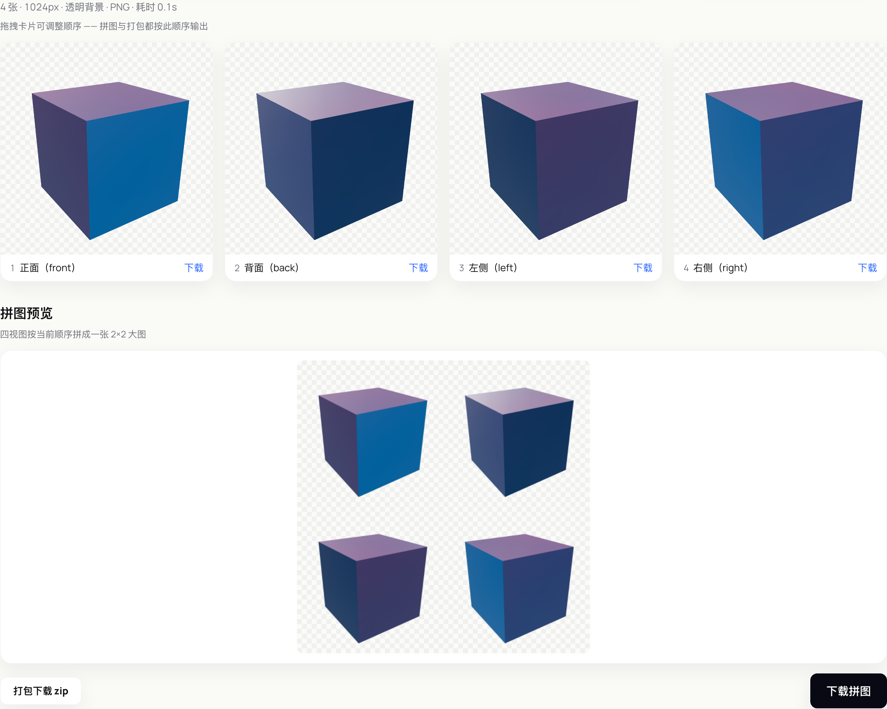

# model-preview

无状态的 3D 模型预览图生成服务：上传一个模型，同步拿回**四张展示级预览图**（正面 / 背面 / 左侧 / 右侧）。

两种用法：`POST /render` 供程序调用；内置 Web 页面供人工出图与演示。服务本身不存任何东西——不落库、不留历史、不做鉴权，请求结束即清空临时目录。渲染在常驻的无头 Chrome 页面池里跑 three.js，**查看器所见即服务端所出**（前后端共用同一套场景模块）。



拖入模型 → 在查看器里转到你要的正面 → 渲染出图。结果卡片可拖拽排序，2×2 拼图预览跟着实时刷新：



## 快速开始

```bash
git clone https://github.com/dtzeng811/model-preview.git
cd model-preview
npm install                  # puppeteer 自带 Chromium，装完即可渲染
npm run build && npm start   # http://127.0.0.1:8790
```

端口默认 8790，可用 `PORT` 环境变量覆盖。只有跑端到端测试时才需要 `npx playwright install chromium`——服务本身用的是 puppeteer 的 Chromium，两者互不相干。

## API

```bash
curl -F file=@fixtures/cube.glb \
     -F size=1024 -F background=transparent -F format=png \
     http://127.0.0.1:8790/render
```

```jsonc
{
  "model":  { "format": "glb", "triangles": 12, "dimensions": { "x": 2, "y": 2, "z": 2 } },
  "images": [ { "view": "front", "data": "<base64>", "width": 1024, "height": 1024 }, ... ]
}
```

`images` 按 `views` 的顺序返回。另有 `GET /healthz`，池未就绪时返回 503。

### 参数（全部可选，multipart/form-data）

| 参数 | 取值 | 默认 | 说明 |
|---|---|---|---|
| `file` | glb / gltf / obj / stl / ply，或 zip | 必填 | 多文件模型（OBJ+MTL、gltf+bin+贴图）打包 zip 上传，入口自动定位 |
| `views` | `front,back,left,right` 的逗号分隔子集 | 全部四个 | |
| `size` | 512 \| 1024 \| 2048 | 1024 | 见方 |
| `background` | `transparent` \| `#RRGGBB` | transparent | |
| `format` | `png` \| `webp` | png | |
| `yaw` / `pitch` | 数字（度） | 0 / 4 | 基准朝向，见下节 |

限制：文件 ≤ 500MB（流式落盘，不整读进内存）；单请求超时 120s；渲染并发 2，超出排队。

### 错误

| 情况 | 响应 |
|---|---|
| 非 multipart 请求 | 415 |
| 缺文件 / 参数非法 / 扩展名不支持 / zip 内无模型 | 400 |
| 文件超 500MB | 413 |
| 模型解析失败（文件损坏） | 422 |
| 排队 30s 仍拿不到渲染页 | 503 |
| 渲染超时（120s） | 504 |

> 4xx 会回传具体原因，但消息里的 URL 会被抹成 `<model>`——loader 的报错常内嵌服务内部的 `/__models` 链接，不该漏给调用方。5xx 一律只回「服务器内部错误」，细节进日志。

## 朝向：模型导入时未必摆正

这是本服务唯一一个「非固定」的渲染参数，也是最值得先读的一节。

四视图是固定的，但「正面」是哪一面由你定：**`yaw` / `pitch` 指定基准朝向，四视图绕它按 0° / 180° / -90° / +90° 出，共用同一仰角**。默认 `yaw=0, pitch=4`（世界坐标 +Z 为正面、略微俯视 4°，与查看器初始机位一致）。

页面会把查看器**当前**朝向作为 `yaw` / `pitch` 一并提交，所以「在查看器里转到满意的角度，再点渲染出图」= 所见即所出。导入的模型躺着、倒着、侧着都不用先去 Blender 里摆正。

`pitch` 是夹取到 ±89° 而非报错：查看器能转到正上 / 正下方，±90° 时 lookAt 与 up 向量共线会退化，夹一下就好，没必要让用户的操作失败。`yaw` 不夹取（转多少圈都等价）。

## Web 页面

左右分栏：

- **查看器**：拖拽旋转、滚轮缩放、拖入文件直接替换模型、左上角模型元信息胶囊、棋盘格底示透明
- **参数面板**：尺寸下拉、背景（透明 / 纯色 + 取色器）、格式（PNG / WebP）。输出角度是固定四视图的静态文案，不可选
- **结果区**：统计行（张数·尺寸·背景·格式·耗时）+ 卡片网格，每张带序号、角度名、单张下载

卡片可拖拽排序，序号实时更新。**2×2 拼图预览跟着顺序实时刷新**——预览与下载共用同一套合成逻辑，只是格子尺寸不同，所见即所得。三种下载：单张、zip（JSZip，文件名带序号前缀如 `1-back.png`）、拼图（一张 PNG）。三者都在浏览器端完成，API 不为此加接口。

<900px 单列。

## 安全加固

模型文件是不可信输入，四条都已实装并有测试覆盖：

- **文件名穿越防护**：只信任 basename。客户端可传 `../../evil.glb` 或 `..\..\evil.glb`——反斜杠要先归一成正斜杠再取 basename，否则 POSIX `basename` 不识别 `\`，反斜杠名原样留下，后续 `\`→`/` 归一会把它还原成穿越路径。
- **zip 炸弹上限**：解压总大小超 2GB 直接中断，不等撑爆磁盘。
- **zip symlink 剥离**：zip 里的符号链接 entry 一律删除，绝不进入文件列表——否则静态挂载的 `/__models` 会变成任意文件读。
- **SSRF 拦截**：模型可内嵌外部 URI（buffer / 贴图），无头 Chrome 会老老实实去 fetch。页面开请求拦截，只放行 `data:` / `blob:` 与**严格同源**（origin 相等，不是前缀匹配——前缀匹配会误放 `http://origin@evil.com/` 这类凭证 URL），其余一律 abort。

## 开发

```bash
npm run dev        # vite build --watch + tsx watch（127.0.0.1:8790）
npm test           # vitest 单测（32 个）
npm run e2e        # Playwright 端到端（16 个，自动 build + start）
npm run smoke      # 无头渲染冒烟：每种格式渲一张，验中心像素非空
npm run fixtures   # 重新生成 fixtures/ 里的测试模型
npm run typecheck  # tsc --noEmit（strict）
```

不做像素级金图对比——跨平台渲染有微差，维护成本不值。e2e 断言的是「四张非空、尺寸正确、透明通道存在」这类结构性质，以及 yaw 的等价性（绕 90° 后的正面应与默认朝向的右侧逐像素相同）。

## 架构备忘（改这个项目前先读）

- 分层：`src/server/`（Fastify + 上传校验 + zip 解压）、`src/render-core/`（**前后端共用**的 three.js 场景模块：loader 分派、归一化、材质回退、PMREM 光照、四视图机位、截图）、`src/render-page/`（无头页入口，暴露 `window.renderModel`）、`src/web/`（页面，复用 render-core）
- **截图必须与查看共用同一 WebGL 上下文**。另开 renderer 截图会让 PMREM 环境贴图跨上下文失效，出图变黑色剪影——原型阶段踩过，别再试。
- **渲染页走 http 而非 `file://`**：`file://` 下 ES module 被浏览器禁掉。所以 `/render.html` 由本服务自己提供，`index.ts` 里必须先 `app.listen` 再 `pool.start()`。
- **卡片拖拽排序用 pointer 事件**，不用 HTML5 原生 DnD——后者在自动化与触屏下都不可靠。
- `RenderPool.allowedOrigin` 不能写成字段初始化器 `= new URL(this.pageUrl).origin`：ES2022 原生 class field 语义下字段初始化器先于构造函数体（含参数属性赋值）执行，此时 `this.pageUrl` 还是 undefined，直接 TypeError。
- 换模型前手动 dispose：`group.clear()` 只解挂不释放 GPU 资源。贴图槽用通用遍历而非硬编码列表（MTLLoader 会填 `bumpMap` / `specularMap` 等非固定槽位），但共享的 PMREM 环境贴图不能随材质释放。
- `fitRadius` 取归一化后包围盒的**半对角线**（外接球半径），不是硬编码 1——硬编码只覆盖球形物体，立方体的角到中心距离达 √3，会导致相机距离不够、模型四角越出画面。
- 归一化顺序：先按最大边缩放到 2 个世界单位，**再重算包围盒居中**。先减原 center 再缩放会留下 `(s-1)·center` 的偏移。毫米制模型（如 150mm STL）不缩放会超出相机 far 平面渲染成空白。
- 内嵌预览环境里 `clientWidth` 可能报 0，resize 逻辑需防御（`clientWidth || fallback` + ResizeObserver）。
- 页面级故障只补一个新页面，绝不重启浏览器（会误杀其它在途渲染）；浏览器断开才整体重启，且带互斥——两个页面同时失败只 launch 一次。

## License

Apache License 2.0，见 [LICENSE](LICENSE)。
